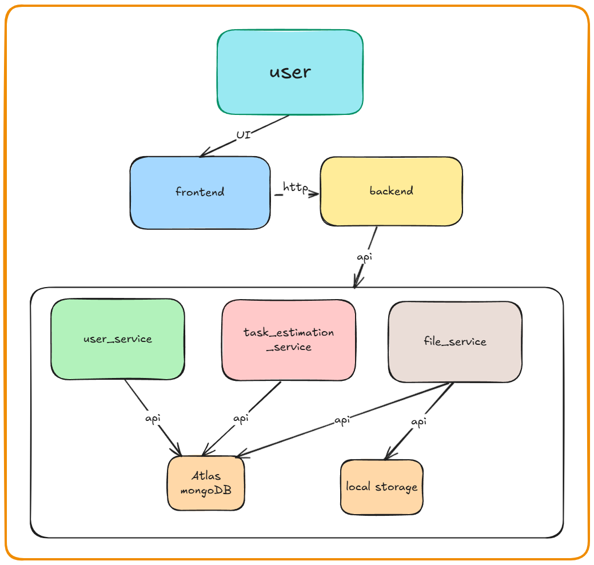

# 🌟 EZlife - Intelligent Task & File Management Platform

*Streamline your productivity with AI-powered task estimation and seamless file management*

## 🎥 Demo Video
*Video demonstration coming soon - [Add Your Video Link Here]*

---

## 📋 About EZlife

EZlife is a comprehensive productivity platform that combines intelligent task management with seamless file operations. Built with a modern microservices architecture, it leverages AI for smart task estimation and provides a unified interface for managing your digital workspace.

### Key Highlights
- **AI-Powered Task Estimation** - Get accurate time predictions for your tasks
- **Intelligent Task Breakdown** - Complex tasks automatically split into manageable subtasks  
- **Seamless File Management** - Upload, organize, and access files with ease
- **Unified User Experience** - Single interface for all your productivity needs
- **Microservices Architecture** - Scalable, maintainable, and reliable

---

## 🏗️ Architecture



### Service Architecture
- **Frontend (React)** - Modern, responsive user interface
- **Backend (FastAPI)** - API gateway and business logic coordinator  
- **User Service** - Authentication, profile management, user operations
- **File Service** - File upload, storage, retrieval, and management
- **Task Estimation Service** - AI-powered task analysis and time prediction
- **MongoDB Atlas** - Primary data persistence layer
- **Local Storage** - File system integration for uploads

---

## ✨ Features

### 🎯 Core Functionality
- **Smart Task Management** - Create, update, and track tasks with AI assistance
- **Intelligent Time Estimation** - Get accurate predictions for task completion
- **Task Breakdown** - Complex projects automatically split into manageable steps
- **File Operations** - Upload, download, and organize files seamlessly
- **User Management** - Complete authentication and profile system

### 🤖 AI-Powered Features  
- **Automated Task Analysis** - Natural language processing for task complexity assessment
- **Smart Time Predictions** - Machine learning models for accurate estimation
- **Context-Aware Suggestions** - Personalized recommendations based on user patterns

### 🔐 Security & Reliability
- **JWT Authentication** - Secure token-based user sessions
- **Input Validation** - Comprehensive data sanitization and validation
- **Error Handling** - Graceful degradation and user-friendly error messages
- **Health Monitoring** - Real-time service status and health checks

---

## 🛠️ Tech Stack

### Frontend
- **React 18** - Modern component-based UI framework
- **Vite** - Fast build tool and development server
- **JavaScript/ES6+** - Modern JavaScript features
- **CSS3** - Responsive styling and animations

### Backend
- **FastAPI** - High-performance Python web framework
- **Python 3.11+** - Latest Python features and performance
- **Pydantic** - Data validation and serialization
- **MongoDB** - NoSQL database for flexible data storage

### DevOps & Infrastructure
- **Docker** - Containerization for consistent deployment
- **Docker Compose** - Multi-service orchestration
- **MongoDB Atlas** - Cloud database hosting
- **RESTful APIs** - Standard HTTP protocols for service communication

---

## 🚀 Quick Start

### Prerequisites
- **Docker & Docker Compose** - Container runtime environment
- **Git** - Version control system
- **API keys** - create an openrouter account and obtain API keys [here(link)](https://openrouter.ai/)
               - create a MongoDB-Atlas account and obtain an API key [here(link)](https://www.mongodb.com/)       

### Installation Steps

1. **Clone the Repository**
   ```bash
   git clone https://github.com/your-username/EZlife.git
   cd EZlife
   ```

2. **Environment Configuration**
   ```bash
   # Copy environment template
   cp .env.example .env
   
   # Edit configuration (add your MongoDB URI, API keys, etc.)
   # nano .env
   ```

3. **Launch Application**
   ```bash
   # Start all services
   docker-compose up --build
   
   # Or run in background
   docker-compose up -d --build
   ```

4. **Access the Application**
   - **Frontend**: [http://localhost:3000](http://localhost:3000)
   - **Backend API**: [http://localhost:8000](http://localhost:8000)
   - **User Service**: [http://localhost:8001](http://localhost:8001)
   - **File Service**: [http://localhost:8003](http://localhost:8003)
   - **Task Estimation**: [http://localhost:8002](http://localhost:8002)

### Verification
```bash
docker-compose ps

docker-compose logs -f

curl http://localhost:8000/health
```

---

## 📡 API Documentation

### Service Endpoints

| Service | Base URL | Health Check | Documentation |
|---------|----------|--------------|---------------|
| Main Backend | `http://localhost:8000` | `/health` | `/docs` |
| User Service | `http://localhost:8001` | `/health` | `/docs` |
| File Service | `http://localhost:8003` | `/health` | `/docs` |
| Task Estimation | `http://localhost:8002` | `/health` | `/docs` |

### Key API Operations

#### User Management
```bash

POST /register
{
  "username": "string",
  "email": "string", 
  "password": "string"
}

POST /token
{
  "username": "string",
  "password": "string"
}
```

#### File Operations
```bash
POST /upload
Content-Type: multipart/form-data

GET /files/{file_id}

DELETE /files/{file_id}
```

#### Task Estimation
```bash
POST /estimate_time
{
  "description": "string",
  "complexity": "low|medium|high"
}

POST /breakdown_task
{
  "description": "string",
  "complexity": "high"
}
```

---

## 🧪 Testing

### Automated Test Suite
Run the comprehensive test suite to verify all functionality:

```bash
# Navigate to test directory
cd AppTests

# Run all tests
python run_tests.py

# Run specific service tests
python run_tests.py --test USER
python run_tests.py --test FILE  
python run_tests.py --test TASK

# Run health checks only
python run_tests.py --test USER_HEALTH
python run_tests.py --test FILE_HEALTH
python run_tests.py --test TASK_HEALTH
```

### Test Coverage
- **13 Total Tests** - Comprehensive coverage across all services
- **User Service** - Authentication, CRUD operations (4 tests)
- **File Service** - Upload, retrieval, deletion (3 tests)  
- **Task Estimation** - Time prediction, task breakdown (3 tests)
- **Health Checks** - Service availability monitoring (3 tests)

---

## 📁 Project Structure

```
EZlife/
├── frontend/                    # React frontend application
│   ├── src/                    # Source code
│   ├── public/                 # Static assets
│   ├── package.json           # Dependencies
│   └── Dockerfile             # Container config
├── backend/                    # Main FastAPI backend
│   ├── main.py                # Application entry point
│   ├── models.py              # Data models
│   ├── db.py                  # Database configuration
│   └── requirements.txt       # Python dependencies
├── backend/user-service/       # User management microservice
├── backend/file-service/       # File handling microservice  
├── backend/task-estimation-service/  # AI task analysis
├── AppTests/                   # Comprehensive test suite
│   ├── test_user_service.py   # User service tests
│   ├── test_file_service.py   # File service tests
│   ├── test_task_estimation_service.py  # Task estimation tests
│   └── run_tests.py           # Test runner
├── docker-compose.yml         # Service orchestration
└── README.md                  # Project documentation
```

---

## 🔧 Development

### Local Development Setup
```bash
# Frontend development
cd frontend
npm install
npm run dev

# Backend development  
cd backend
pip install -r requirements.txt
uvicorn main:app --reload

# Run individual services
cd backend/user-service
uvicorn main:app --port 8001 --reload
```

## 🤝 Contributing

We welcome contributions from the community! Whether it's bug fixes, feature enhancements, or documentation improvements, your input helps make EZlife better for everyone.

### How to Contribute
- Report bugs and suggest features via GitHub Issues
- Submit pull requests for code improvements
- Help improve documentation and user guides
- Share feedback and usage experiences

---

## 🙏 Acknowledgments

Built with modern tools and frameworks that make development efficient and enjoyable:
- **FastAPI** for the excellent Python web framework
- **React** for the powerful frontend capabilities  
- **MongoDB** for flexible data storage
- **Docker** for simplified deployment and scaling

---

